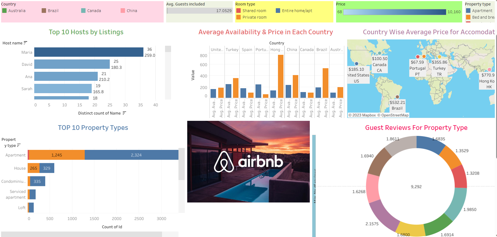
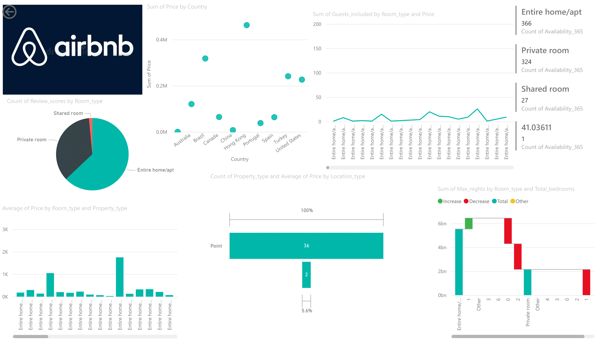

# AirBNB-Data-Analysis

### Video Link : Problem Statement :

This project aims to analyze Airbnb data using MongoDB Atlas, perform data cleaning
and preparation, develop interactive geospatial visualizations, and create dynamic
plots to gain insights into pricing variations, availability patterns, and location-based
trends. The objectives are to:

1. Establish a MongoDB connection, retrieve the Airbnb dataset, and ensure
   efficient data retrieval for analysis.
2. Clean and prepare the dataset, addressing missing values, duplicates, and
   data type conversions for accurate analysis.
3. Develop a streamlit web application with interactive maps showcasing the
   distribution of Airbnb listings, allowing users to explore prices, ratings, and
   other relevant factors.
4. Conduct price analysis and visualization, exploring variations based on
   location, property type, and seasons using dynamic plots and charts.
5. Analyze availability patterns across seasons, visualizing occupancy rates and
   demand fluctuations using suitable visualizations.
6. Investigate location-based insights by extracting and visualizing data for
   specific regions or neighborhoods.
7. Create interactive visualizations that enable users to filter and drill down into
   the data.
8. Build a comprehensive dashboard using Tableau or Power BI, combining
   various visualizations to present key insights from the analysis.
   Data: MongoDb

### Python Libraries Used :

1. Python
2. Streamlit
3. PyMongo
4. Matplotlib
5. Seaborn
6. PIL
7. Folium
8. Streamlit-Folium
9. Plotly

#####    Data Viz Tools Used :

1. Tableau
2. PowerBI

### Workflow :

**Step 1 :** Create an account in Mongo Atlas, create a project and then create a cluster. In that cluster, import the sample database for AirBNB.

**Step 2 :** Establish a connection with the db present in Mongo Cluster using Pymongo library and convert the data into a dataframe.

**Step 3 :** After that, perform Data Cleaning and Data Preprocessing to convert the data into a suitable format.

**Step 4 :** Perform Data Exploration by drawing different charts based on different columns.

**Step 5 :** Create Dashboards using Tableau and Power BI using the cleaned data.

**Step 6 :** Geospatial Analysis: Leverage geospatial libraries like Folium for geospatial data processing and visualization, gaining knowledge and skills in
analyzing and visualizing spatial patterns.

### My Dashboards :

1. Using Tableau

   
2. Using PowerBI

